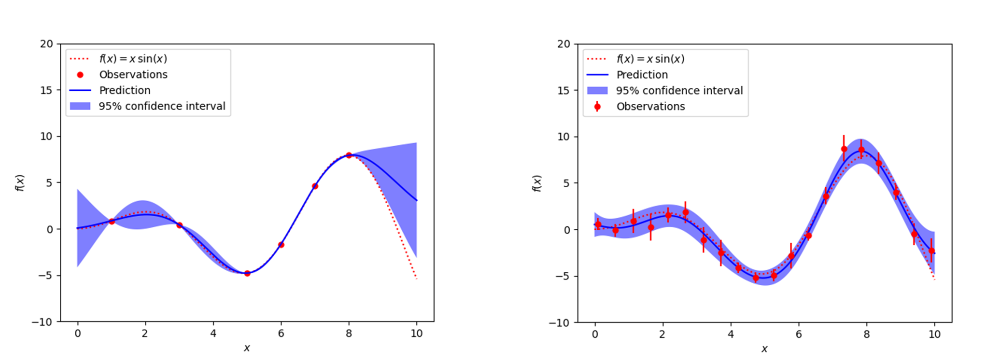

.. atbd - algorithm theoretical basis
   Author: Pieter De Vis
   Email: pieter.de.vis@npl.co.uk
   Created: 15/04/22

.. _interpolation_atbd:

===========================================
Interpolation Algorithm Theoretical Basis
===========================================

1. Terminology and Notation
=============================

First we define how we use certain terms and notations in this document.
Of course, these meanings only supplement (rather than replace) the full
meaning of these terms in the VIM and the GUM suite of documents. First,
we define what we understand by interpolation. Interpolation is a statistical
method by which related known parameter values at a number of coordinates
are used to estimate unknown parameter values at some other provided coordinates.
Here, we consider interpolation to only include cases where the interpolation
function goes through the estimated parameter values.

*  Measurand :math:`Y`: The quantity of interest or dependent quantity.
   Within the context of interpolation, this is the quantity we are
   trying to obtain from the interpolation process. Typically, the
   y-axis quantity in classical interpolation examples.

*  Independent variable quantity :math:`X`: The values for which we are
   trying to obtain the measurand. Within the context of interpolation,
   these are the known values (typically the x-axis) that we will give
   to the interpolation function.

*  Measurement function :math:`f`: The function linking the measurand
   :math:`Y` to the independent variable :math:`X` so that
   :math:`Y = f(X)` for any :math:`X`

*  Measured data points: The data points for which we have data
   available for both the measurand and independent variable quantities.
   These are the data points between which we try to interpolate. The
   quantities :math:`X_{i}\ `\ and :math:`Y_{i}` are used as (dummy)
   variables to denote the coordinates of the *i-*\ th measured data
   point. :math:`x_{i}` and :math:`y_{i}\ `\ are the measured values (or
   estimates) of the coordinates of the *i-*\ th data point.

*  Interpolation function :math:`\widehat{f}`: The measurement
   model, i.e., the function that determines the measurands for a given
   set of independent variable quantities. By definition, this function must
   pass through the measured data points.

As an example for this terminology, we can describe a use case in the
Earth Observation (EO) field using these terms. One of our most common use cases is
spectral interpolation. Let’s assume we have a set of radiometric
measurements at 10 different wavelengths and want to interpolate to
obtain the radiance at wavelengths between the 10 given wavelengths. We
assume we are observing an ideal black body at a fixed temperature. In
this case, the measurand Y would be the (true) radiance at a given
wavelength (the independent variable quantity X). The measurement
function f will be the blackbody curve (i.e. Planck’s law). In practise,
what we have available would be a set of measurements of the radiances
for some given wavelengths. The true values for these radiances
(:math:`Y_{i}`) and wavelengths (:math:`X_{i}`) are not known. Instead we
have measurements (i.e. estimates) for the radiances (:math:`x_{i}`) and
wavelengths (:math:`y_{i}`). We’ll then define an interpolation function
:math:`\widehat{f}` which has parameters that depend on the values of
(:math:`x_{i},y_{i}`). There are various interpolation methods we could use,
but none of them will be perfect (nor exactly the same as the true
measurement function f). The details of interpolation will be discussed
throughout this document using the above terms.

2. 1D-interpolation without high resolution example
========================================================

Our first use case is a simple interpolation along one dimension, where
no further information is available about how the measurand changes
between the measured data points.

Consider :math:`n` measured data points (:math:`x_{i},y_{i}`) with
:math:`i = 1,\ldots,n,\ `\ where :math:`x_{i}\ `\ are ordered distinct
values of the independent variable quantity :math:`X` and
:math:`y_{i}\ `\ are corresponding estimates of the measurand :math:`Y`.
Here, we are trying to define an interpolation function
:math:`\widehat{f},` that goes through the measured data points:

.. math::
   y_{i} = \widehat{f}\left( x_{i} \right)\ ,

and which transforms any value :math:`x` for the independent variable
quantities :math:`X`, with :math:`x_{1} < x < x_{n},` to a predicted
value :math:`\widehat{f}` for the corresponding measurand :math:`Y`:

.. math::
   \widehat{f} = \widehat{f}(x).

The interpolation function :math:`\widehat{f}` depends on the independent
variable quantity :math:`x` and contains some parameters that are defined
by the set of data-points
:math:`\left\{ \left( x_{i},\ y_{i} \right) \right\}` used to constraint
it. A more rigorous notation, yet more cumbersome, would be
:math:`\widehat{f}_{(x_{i},\ y_{i})}(x)`.

The general measurement model can be written as:

.. math::
   Y = \widehat{f}(X) + \Delta(X)

where the :math:`+ \Delta(X)` term is added to account for the model
error in the interpolation, that is, the information about :math:`f` that
cannot be captured by choosing a specific shape for :math:`\widehat{f}`.

2.1. Analytical interpolation methods
-------------------------------------

There are various interpolation methods that can be used. The first
category we discuss are what we call ‘analytical’ interpolation methods,
where a unique line passes through the data points. This can be done
through all data points at once (for example, for :math:`n` data points,
an interpolating polynomial of order :math:`n - 1` or cubic spline is
used. Or it can be done on smaller subsets of the data (e.g., subsets of
4 data points for cubic interpolation, or 2 data points for
straight-line interpolation).

Here we provide some more details on the example of straight-line
interpolation. With this method, the interpolated measurand value
at :math:`\text{\ x}` (here with :math:`x_{1} < x < x_{2}` ) is defined
as:

.. math::
 \widehat{y}=\widehat{f}(x) = \left\lbrack 1\  - \ \alpha(x) \right\rbrack y_{1}\  + \ \alpha(x)y_{2},

where

.. math::
 \alpha(x) = \frac{x - x_{1}}{x_{2} - x_{1}}\ .

If here we assume the errors associated with the values :math:`y_{1}`
and :math:`y_{2}` are uncorrelated, and there is no uncertainty
associated with the :math:`x_{i}`, it is straightforward to propagate
the standard uncertainties on the measured data points as:

.. math::
 u_{\widehat{y}}^{2}\  = \left\lbrack 1\  - \ \alpha(x) \right\rbrack^{2} u_{y_{1}}^{2}\  + \ {\alpha(x)}^{2}u_{y_{2}}^{2}\ .

Here the standard uncertainty associated with a value :math:`q` is
denoted by :math:`u_{q}`. However, :math:`u_{y}\ `\ is the standard
uncertainty under the assumption that between the measured data points
the measurand varies linearly with :math:`x` (the uncertainty
propagation assumes the model is correct, and does not consider the
uncertainty associated with the model itself, see the :math:`\Delta(x)`
term in Equation 3). This assumption often does not hold, in which case
we need to add a model error term, which will typically be largest
halfway between the data points. However, it is not straightforward to
quantify this model error.

For the analytical interpolation methods, one can put some constraints
on the model error term. One approach is to
use several different analytical interpolation methods and quantify the
difference between them. E.g., when lacking any knowledge of how the
measurand varies with :math:`f`, it could be entirely reasonable
(depending on the use case) to try straight-line, quadratic spline, and
cubic spline interpolations and quantify the uncertainty associated with
the model error from the difference between the different interpolated
points.

2.2. Statistical interpolation methods
--------------------------------------

Another approach is to use a more statistical approach like kriging,
also known as gaussian process regression, which is a method of
interpolation based on gaussian process governed by prior covariances. A
gaussian process defines a probability distribution for infinitely-many
random variables as a generalisation of the (usual) Gaussian
distribution for finitely-many random variables. The basic idea of
kriging is to predict the value of a function at a given point by
computing a weighted average of the known values of the function in the
neighbourhood (defined by the prior covariances) of the point. The
method is mathematically closely related to regression analysis. A full
description of kriging is beyond the scope of this document.

The main benefit of this approach is that it intrinsically considers
both the uncertainty on the measured data points, as well as the model
error component (see Figure 1 for an example with and without
measurement uncertainties). With gaussian process regression, we can
thus simultaneously get the interpolation function and its uncertainties
(both from the measured data points and uncertainty associated with the
model error). Gaussian process regression would require us to provide
the uncertainties on the measured data points (or optionally their
covariance matrix), and a kernel (which will require some thought to
choose the appropriate one).

3. 1D-interpolation using high-resolution example
=================================================

For our next use case, we are still interpolating along a single
dimension, but now we have some model for how the measurand varies in
function of :math:`x` between the measured data points. In some cases,
this model simply has free parameters that can be set so that the model
passes through the measured data points. In other cases, we have a
semi-empirical model, where the behaviour of the curve between the
measured points is dominated by a physical process. For example, in the
spectral interpolation of a tungsten-lamp based source, the blackbody
curve provides the dominant shape. In these cases, in the past we have
used an approach where first the physical model was fitted, then the
residuals with this physical model were calculated. By then
interpolating the residuals using empirical methods (as in the previous
section) and then again combining these residuals with the physical
model (here the blackbody curve) will give better results than just
interpolating the original data points using analytical methods (such as
cubic spline).

In the climate & earth observation group, we also have multiple current
use cases where, rather than having a multivariate model, we have
some higher resolution (in the :math:`x` dimension) measurements for an
analogous measurement. Here when referring to high-resolution we mean a
higher sampling rate (rather than bandwidth resolution etc, see Section
3.3). Here, we want to use this high-resolution example to inform
us on how to interpolate between our measured (low-resolution in
:math:`x`) data points. Of course, since we are interpolating, we still
usually want our final interpolation function to go through the measured
data points (in some cases we may prefer to fit a curve that does not go
through those points, but that would be considered in a fitting
algorithm rather than an interpolation algorithm). So here the question
becomes, how can we modify our high-resolution example so that it goes
through the measured data points, and we can use the modified
high-resolution data as our interpolated data points. We will again do
this by looking at the residuals between the high-resolution example and
the measured data points. Residuals can be defined in an absolute and
relative way. We’ll start by discussing the absolute case, and then
consider relative residuals.

The measurement model for the measurement function :math:`f` can again
be written as :math:`Y = f(X)=\widehat{f}(X) + \Delta(X)`. In order to show the
difference with the equations in the previous section, we here use the more rigorous notation:

.. math::`Y=f(x)=\widehat{f}_{\left\{(x_{i},\ y_{i})\right\};\left\{(x_{HR,i},\ y_{HR,i})\right\}}(x)+\Delta{x}`.

where
:math:`\left\{ \left( x_{\text{HR,i}},\ y_{\text{HR,i}} \right) \right\}`
is the set of high resolution measurements that serve as the
high-resolution example, and all the other terms are defined as previously.

3.1 Interpolation of absolute residuals
-----------------------------------------

One potential solution is to define a new model in such a way that it
starts from the high-resolution model :math:`y_{\text{HR}}(x)`, and to
modify it so that the model must go through the measured data points.
This can be done multiplicatively, or additively. We first define a
measurement model for :math:`y_{\text{HR}}`, which interpolates between
the high-resolution data points:

.. math::h(x)=f ̂_HR (x)+Δ_"HR"  (x)
 h(x) = {\widehat{f}}_{HR}(x)+ \Delta_{HR}(x),

Where :math:`{\widehat{f}}_{HR}` provides the interpolation between the set
of high resolution measurements
:math:`\left\{ \left( x_{\text{HR,i}},\ y_{\text{HR,i}} \right) \right\}`,
which can be performed as in Section 2.

For an additive model, the interpolation function f between the
low-resolution measured data points, can then be defined as:

.. math::
 \widehat{f}(x) = h(x) + p(x)

where :math:`\widetilde{f}(x)` gives the residuals of the difference
between the model and the high-resolution example. In order to fully
define the function :math:`{\widehat{f}}_{}`, we now only need to be able
to define :math:`\widetilde{f}(x)` for every :math:`x`. For the measured
data points, we have specified the model goes through the measured data
points, and we thus know that:

.. math::
 \widehat{f}(x_{i}) = y_{i}

.. math::
 h(x_{i}) + p(x_{i}) = y_{i}

.. math::
  p(x_{i}) = y_{i} - h(x_{i})

This defines the value of the residuals in each of the data points. In
order to know the values between these, we can apply standard
interpolation techniques, such as discussed in Section 2.

Once the function :math:`\widetilde{f}(x)` has been determined for every
:math:`x` using interpolation, we can get values for our model
:math:`{\widehat{f}}_{}` by substituting :math:`\widetilde{f}(x)`\ back in
Equation (14).

For the uncertainties, there would now be three contributions: one from
the measured data points :math:`u_{y}\left( x_{i} \right)`, one from the
high-resolution model :math:`u_{\text{HR}}(x)`, and one from the
interpolation model error.

The uncertainties on both the low and high resolution datapoints are propagated using
a MC method (see also `this ATBD <https://punpy.readthedocs.io/en/latest/content/atbd.html#monte-carlo-method>`_).
The interpolation model uncertainties for classical methods (Section 2.1)
are estimated by calculating the standard deviation between trying various
different interpolation methods. At least three different methods are compared
to determine this uncertainty contribution. For statistical interpolation
methods (Section 2.2), the model uncertainties are calculated as one of
the output of the algorithm and can thus readily be used.

Interpolation of relative residuals
-----------------------------------

An equivalent prescription can be made where the model :math:`f` is
defined instead as:

.. math::
 f(x) = \ h(x) \times p(x).

In this case it follows from the assumption that this model must go
through the measured data points that:

.. math::
 p\left( x_{i} \right) = \frac{y_{i}}{h\left( x_{i} \right)},

which again yields a value for the :math:`p(x)` function for each of the
data points, for which again we can use the interpolation methods from
Section 2 to get\ :math:`p(x)`\ for any data point and
substitute the result in Equation (18).

We note that both cases are equivalent, and can be converted into each
other by simply taking the logarithm (though proper care should be taken
in the transformation of the uncertainties and probability
distributions). The uncertainty propagation is also completely analogue,
but using relative uncertainties instead of absolute uncertainties.

Resolution considerations
-------------------------
In the previous section, we have stated that we use a high-resolution
example in order to interpolate between low-resolution data points. Here
we specify in some more detail what is meant by this and give some other
considerations about resolution. When we are talking about our
high-resolution example, we are really talking about the sampling
interval, i.e. the step size. The high-resolution examples thus simply
have more measurement between two of the low resolution data points.

The confusion comes from the fact that within EO, resolution often
refers to the bandwidth of a certain measurement. Any radiance
instrument will be sensitive not only to a single wavelength, but to a
range of wavelengths. This range of wavelengths can be described by the
spectral response function (SRF), which is typically characterised by a
single parameter, the bandwidth.

For most applications in EO where we use a high-resolution spectrum as
an example to interpolate between some low-resolution measured data
points, the bandwidth for the high-resolution and low-resolution will be
different. However, in order to apply our interpolation methods
consistently, both the measured data points and the high-resolution
(i.e. small sampling intervals) example need to have the same bandwidth
(and ideally the same SRF shape as well). If this is not the case, a
pre-processing step should be applied. This can be done to the spectrum
with the smallest bandwidth in order to make the SRFs as consistent as
possible (convolving this spectrum with e.g. a gaussian filter will
widen the band with), or to the measured data points by applying a
correction (needs to assume the spectral shape is known). This
pre-processing step will not be handled by the **comet_maths** interpolation module, and
will need to be done prior to passing the data.
